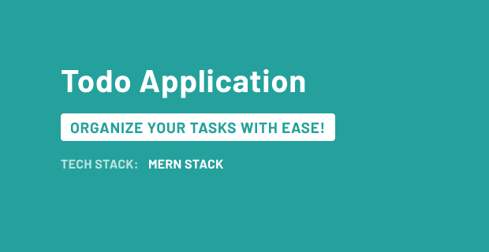

Here's the updated `README.md` file with a section added to guide users on setting up the `.env` file for both the frontend and backend. 


# 🌟 MERN Todo Application



> A modern and beautiful Todo application built using the MERN stack (MongoDB, Express, React, Node.js) with Tailwind CSS for stunning visuals and smooth animations.

## 🎥 Demo


> **Tip:** Click on the video above to see a demo of the application in action!

## 🚀 Features

- ✨ **Create, Read, Update, Delete** (CRUD) todos with ease
- 🎨 Responsive and modern UI with Tailwind CSS
- 🌈 Smooth animations and intuitive design
- 🔄 Toggle task completion with a single click
- 📅 Sort and filter tasks to manage your day better

## 🛠️ Installation & Setup

### Prerequisites

- **Node.js** and **npm** installed
- **MongoDB** running locally or in the cloud (e.g., MongoDB Atlas)

### 1. Clone the Repository

```bash
git clone https://github.com/your-username/mern-todo-app.git
```

### 2. Setting Up Environment Variables

For the application to run correctly, you need to set up environment variables in both the frontend and backend. Follow these steps:

#### Backend (`/backend`)

1. Navigate to the `backend` directory:

    ```bash
    cd backend
    ```

2. Create a `.env` file in the `backend` directory and add the following variables:

    ```env
    MONGO_URI=your-mongodb-uri
    PORT=5000
    ```

    Replace `your-mongodb-uri` with your actual MongoDB connection string.

### 3. Installing Dependencies

#### Frontend

1. Navigate to the frontend directory and install dependencies:

    ```bash
    cd frontend
    npm install
    ```

2. Start the frontend development server:

    ```bash
    npm run dev
    ```

    The frontend will be running on `http://localhost:5173`.

#### Backend

1. Navigate to the backend directory and install dependencies:

    ```bash
    cd backend
    npm install
    ```

2. Start the backend server:

    ```bash
    npm run dev
    ```

    The backend will be running on `http://localhost:5000`.

## 🌟 Usage

1. Open your browser and navigate to [http://localhost:5173](http://localhost:5173).
2. Use the application to add, update, delete, and toggle the completion of your todos!

## 🎨 Project Structure


mern-todo-app/
│
├── frontend/                 
│   ├── assets/               
│   ├── public/               
│   ├── src/                  
│   │   ├── components/       
│   │   ├── pages/            
│   │   ├── App.jsx           
│   │   └── index.jsx         
│   ├── tailwind.config.js    
│   └── ...
│
├── backend/                 
│   ├── models/               
│   ├── routes/               
│   ├── server.js             
│   └── ...
│
└── README.md                 


## 🤝 Contributing

Contributions, issues, and feature requests are welcome! Feel free to check the [issues page](https://github.com/your-username/mern-todo-app/issues).

1. **Fork the project**
2. **Create your feature branch** (`git checkout -b feature/amazing-feature`)
3. **Commit your changes** (`git commit -m 'Add some amazing feature'`)
4. **Push to the branch** (`git push origin feature/amazing-feature`)
5. **Open a Pull Request**

## ✨ Acknowledgements

- [React](https://reactjs.org/)
- [Tailwind CSS](https://tailwindcss.com/)
- [MongoDB](https://www.mongodb.com/)
- [Node.js](https://nodejs.org/)

## 📧 Contact

Feel free to reach out via [LinkedIn](https://www.linkedin.com/in/om-saraykar/) or email me at [omsaraykar@example.com].
